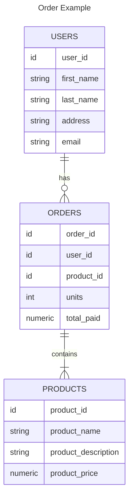

# Schemas

# A simple example


```mermaid
---
title: Order Example
---
erDiagram
  USERS ||--o{ ORDERS : has
  ORDERS ||--|{ PRODUCTS : contains
  USERS {
    id user_id
    string first_name
    string last_name
    string address
    string email
  }
  ORDERS {
     id order_id
     id user_id
     id product_id
     int units
     numeric total_paid
  }
  PRODUCTS {
     id product_id
     string product_name
     string product_description
     numeric product_price
  }
```

```mariadb
CREATE DATABASE 
```

