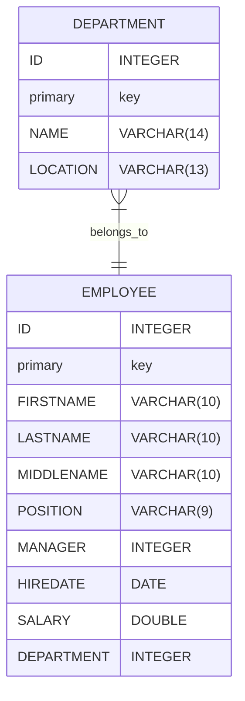

# Session 15/03/2024

## Agenda

* Concurrent TicTacToe (Task)
* Understanding Databases
* Database Foundations
* Tables
* Relationships
* SQL Overview
* SQL Fundamentals Concepts
* SQL Strings
* SQL Numbers and Dates
* SQL Aggregates, Transactions, and Triggers
* SQL Views and Sub-selects
* Database Optimization
* Creating a Database Structure and Querying a Database
* Introduction of Advanced Database Features
* Java Data Access (JDA)
* JDBC

---

# Concurrent TicTacToe (Task)

* [Description](https://gitlab.com/juan_cardona_epam/concurrent-tic-tac-toe)

---

# Understanding Databases:

- What is a database?
- Types of databases (relational, hierarchical, etc.)
- Database management systems (DBMS)
- Importance of databases in modern business

---

## What is a database?

>  "A database is a structured collection of data organized and stored
>  in a computer system.
>  It provides a means for efficiently storing, retrieving, and manipulating
>  large volumes of data using predefined rules and operations."

---

## Types of databases

1. Relational Database
2. Hierarchical Database
3. Object-Oriented Database
4. NoSQL Database
5. Graph Database
6. Time-Series Database
7. Spatial Database
8. Cloud Database
9. In-Memory Database
10. Big Data Database

---

## Database Management Systems (DBMS)

> A DBMS (Database Management System) is a software application
> that enables database creation, manipulation, and management.
> It bridges user applications and databases, handling tasks like
> data organization, security, and optimization.
> It provides an interface for users to interact with databases and
> ensures efficient and reliable data operations.

---

## Importance of databases on modern bussiness

1. Centralized Data Storage
2. Data Organization
3. Data Analysis and Insights
4. Informed Decision-Making
5. Enhanced Efficiency
6. Improved Collaboration and Data Sharing
7. Customer Experience Enhancement
8. Streamlined Operations
9. Data Security and Compliance
10. Business Growth and Competitiveness

---

# Database Foundations:

- Data models
- Entities and attributes
- Primary and foreign keys
- Normalization
- Data integrity constraints

---

## Data Models

Data models represent the logical structure of a database.

1. Relational Data Model.

2. Object-Oriented Data Model.

Other data models include hierarchical, network, and document-based models.

---

## Normalization:

1. Organization technique to eliminate data redundancy.
2. Breaks data into logical tables to minimize duplication.
3. Ensures data is stored efficiently and avoids anomalies.
4. Improves data integrity and reduces update anomalies.
5. It helps maintain consistency and accuracy in the database.

---

## Data Integrity Constraints

1. Primary Key Constraint: Ensures uniqueness of records.
2. Foreign Key Constraint: Establishes relationships between tables.
3. Unique Constraint: Prevents duplicate entries in a column.
4. Not Null Constraint: Ensures a column must have a value.
5. Check Constraint: Verifies specific conditions for column values.

---

## Entities and Attributes

**Entities**

1. Represent distinct and identifiable objects or concepts within a domain.
2. Model real-world elements like people, places, things, or events.

**Attributes**

1. Describe the specific properties or characteristics of an entity.
2. Provide detailed information about an entity's unique qualities.
3. Capture and store specific data related to an entity.
4. It can have different data types such as text, numeric, date, or boolean.

---

## Primary and Foreign Keys

**Primary Key**

1. Unique identifier for each record in a table.
2. Ensures data integrity and uniqueness.
3. Used to access individual rows in a table.

**Foreign Key**

1. A field or combination of fields refers to another table's primary key.
2. Establishes relationships between tables.
3. Enforces referential integrity and maintains data consistency.
4. Enables retrieval of related data across multiple tables.

---

# Tables

- Table definition
- Elements of a table
- Column's data types
- Indexing tables
- Operations
- Table constraints

---

## Table Definition

> In the context of a database, a table is a structured collection of data
> organized in rows and columns. It represents a logical representation of
> data stored in a relational or tabular format. Tables serve as the
> fundamental containers for organizing and storing data within a database,
> with columns defining the attributes, rows representing individual
> data entries, and keys establishing relationships between tables.

---

## Elements of a Table

1. Columns (Attributes)
2. Rows (Records)
3. Cell
4. Primary Key
5. Foreign Key
6. Table Name

---

## Column's Data Types

1. `INTEGER`
2. `FLOAT`/`DOUBLE`
3. `CHAR`
4. `VARCHAR`
5. `DATE`
6. `TIME`
7. `DATETIME`/`TIMESTAMP`
8. `BOOLEAN`
9. `NUMERIC`/`DECIMAL`
10. `TEXT`/`LARGETEXT`

---

## Index a Table

1. Improved Query Performance
2. Faster Data Retrieval
3. Efficient Sorting and Ordering
4. Support for Unique Constraints
5. Optimized Joins
6. Flexibility in Data Access

---

## Operations

Operations Related to Table Structure:

1. Create
2. Alter
3. Drop

Other Operations on a Table:

4. Select
5. Insert
6. Update
7. Delete
8. Join
9. Aggregate
10. Sort
11. Filter
12. Group

---

## Table Constraints

> Table constraints are rules or conditions applied to a table in a database
> to maintain data integrity and enforce specific requirements on the data
> stored within the table. They define limitations or restrictions
> on the values that can be inserted, updated, or deleted in a table.
> Table constraints ensure that the data adheres to specific predefined
> rules, such as uniqueness, referential integrity, and data validity,
> thereby maintaining consistency and reliability within the database.

---

# Relationships:

- Types of relationships
- Creating and managing relationships
- Cascading actions
- Enforcing referential integrity

---

## Relationships Definition

> Database relationships define the associations or connections between
> tables in a database. They establish how tables are related and interact
> with each other based on common data elements or key columns.

---

## Types of Relationships

1. One-to-One (1:1)
2. One-to-Many (1:N)
3. Many-to-One (N:1)
4. Many-to-Many (N:N)

---

## Cascading Actions

> Cascade actions refer to the automatic propagation of changes
> from one table to related tables through defined relationships
> in a database. When a specific operation, such as an update or
> delete, is performed on records in a table, cascade actions
> ensure that these changes are automatically applied
> to associated records in related tables.

---

## Type of Cascading Actions

1. Cascade Update
2. Cascade Delete
3. Cascade Insert

---

## Referential Integrity

> Referential integrity ensures the accuracy and consistency
> of relationships between tables in a database. It enforces
> rules that require foreign keys to match existing primary
> keys in related tables. This prevents invalid or orphaned
> relationships and maintains data integrity. Referential
> integrity is implemented through primary keys, foreign
> keys, and cascading actions for automatic updates or
> deletions. It aims to ensure valid and meaningful data
> relationships in a relational database.

---

# SQL Overview

- What is SQL?
- A Very Short History of SQL
- SQL standards
- SQL dialects (MySQL, Oracle, SQL Server, etc.)

---

## What is SQL?

> SQL (Structured Query Language) is a standardized programming
> language for managing relational databases. It allows users to
> interact with databases by executing commands to query, insert
> update, and delete data. SQL is essential for working with structured
> data in tables and is supported by popular database management
> systems like MySQL, Oracle, and SQL Server. It provides a consistent
> and powerful way to interact with databases, making it a crucial
> skill for developers and database administrators.

---

## A Very Short History of SQL

> SQL was created in the 1970s by a team of IBM researchers,
> led by Donald D. Chamberlin and Raymond F. Boyce. The language was
> initially called SEQUEL (Structured English Query Language) and was
> developed to facilitate data retrieval and manipulation in IBM's
> System R relational database management system. SEQUEL later
> underwent some changes to become the SQL we know today.
> The development of SQL marked a significant milestone in the field of
> database management, providing a standardized and efficient language
> for working with relational databases.

---

## SQL Standards

1. SQL-86 (SQL-87 or SQL1)
2. SQL-92 (SQL2)
3. SQL:1999
4. SQL:2003
5. SQL:2008
6. SQL:2011
7. SQL:2016
8. SQL:2019

---

## SQL Dialects

SQL dialects are variations of the SQL language specific to different DBMS.

- MySQL.
- Oracle.
- Microsoft SQL Server.
- PostgreSQL.
- SQLite.

> While core SQL commands are expected, dialects may have syntax and
> functional differences. Adhering to ANSI SQL standards promotes
> code compatibility across DBMS.

---

# SQL Fundamental Concepts:

- SELECT statement syntax
- Basic filtering and sorting
- Aliasing columns and tables
- Working with NULL values
- Data manipulation (INSERT, UPDATE, DELETE)

---

# SQL Strings:

- String functions and operators
- String concatenation
- Pattern matching with LIKE
- Case sensitivity and collation

---

# SQL Numbers and Dates:

- Numeric data types and operators
- Mathematical functions
- Date and time data types
- Date manipulation functions
- Date formatting and conversion

---

# SQL Aggregates, Transactions, and Triggers:

- Aggregate functions (SUM, AVG, COUNT, etc.)
- Grouping and filtering aggregated data
- Transactions and ACID properties
- Database triggers and their usage

---

# SQL Views and Sub-selects:

- Creating and managing views
- Benefits of using views
- Sub-selects and their syntax
- Nested and correlated sub-selects
- Using sub-selects in WHERE and FROM clauses

---

# Database Optimization:

- Indexing strategies
- Query optimization
- Denormalization
- Performance tuning
- Monitoring and troubleshooting database performance

---

# Creating a Database Structure and Querying a Database:

- Designing a database structure (tables, relationships, constraints)
- Creating databases and tables using SQL
- Querying databases using SQL SELECT statements
- Filtering and sorting data
- Joining tables

---

# Introduction of Advanced Database Features:

- Stored procedures
- Functions and triggers
- Views and materialized views
- Database security
- Data backup and recovery

---

# Java Data Access (JDA)

> **Java Data Access (JDA)** refers to the techniques and libraries
> that connect Java applications with databases.
> It provides a framework for managing data and executing SQL queries.
> JDA includes JDBC, a standard API for connecting to relational
> databases, and Object-Relational Mapping frameworks like Hibernate and JPA.
> JDA simplifies database connectivity, data retrieval, and transaction
> management in Java applications, improving performance and data
> consistency. With JDA, developers can build robust and scalable
> applications that interact with databases seamlessly.

---

# Java Data Access - Aspects

1. JDBC (Java Database Connectivity).

2. Object-Relational Mapping (ORM) frameworks.

3. Connection pooling.

4. Data source configuration.

5. Transaction management.

6. Query execution and result handling.

7. Data access patterns.

8. Performance optimization.

---

# JDBC

> JDBC (Java Database Connectivity) is a standard Java API for
> connecting Java applications to relational databases. It enables
> executing SQL queries, fetching query results, updating data,
> and managing transactions.

Key features of JDBC include:

1. Database Connection
2. SQL Execution
3. Query Results
4. Prepared Statements
5. Transaction Management
6. Exception Handling
7. Database Metadata

---

